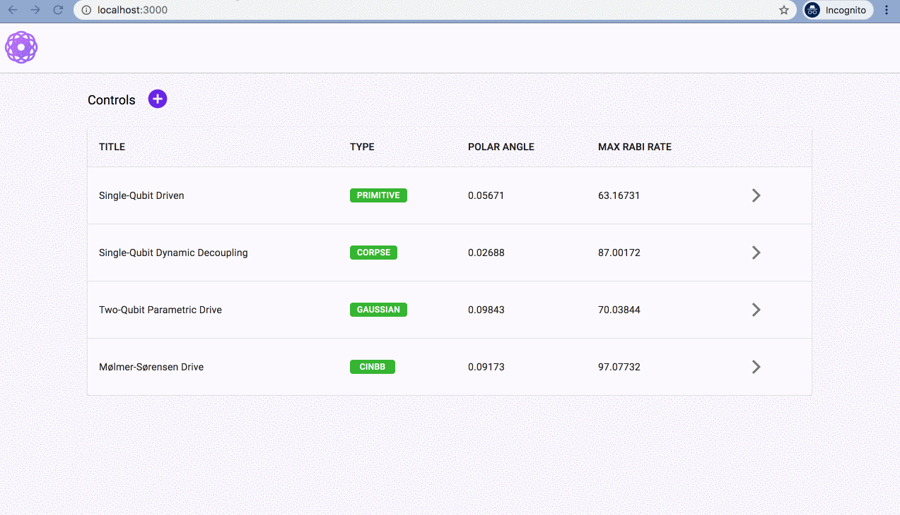
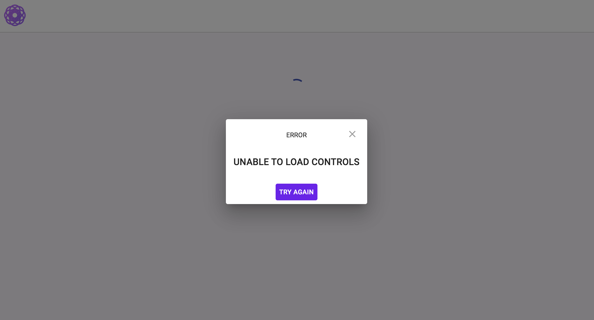

# Frontend coding test

## Tech Stack

- [x] [Typescript](https://www.typescriptlang.org/)
- [x] [React](https://facebook.github.io/react/)
- [x] [Redux](https://github.com/reactjs/redux)
- [x] [Redux Thunk](https://github.com/reduxjs/redux-thunk)
- [x] [React Router](https://github.com/ReactTraining/react-router)
- [x] [Redux DevTools Extension](https://github.com/zalmoxisus/redux-devtools-extension)
- [x] [Webpack](https://webpack.github.io)
- [x] [PostCSS Loader](https://github.com/postcss/postcss-loader)

## Installation

```
$ npm ci
```

## Running

```
$ npm start
```

### Controld page

- Url: [http://localhost:3000/](http://localhost:3000/)
- Check source code at [src](src) folder

### Documentation page

- Url: [http://localhost:3000/assets/posh.html](http://localhost:3000/assets/posh.html)
- Check source code at [src/assets/posh.html](src/assets/posh.html) 

## Screenshot
Controls page loading


Documentation


Controls page's error dialogue 



## TODO
- more responsive design support for controld page and documentation page
- more responsive design support for control page
- unit tests for actions and reducers
- regression tests for loading flow with cypress lib